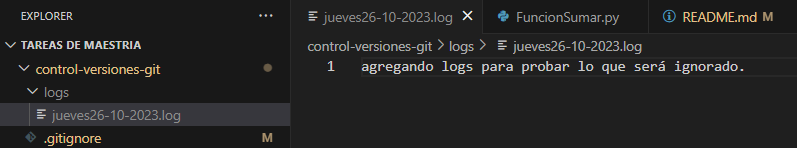

# CONTROL DE VERSIONES GIT
## Tarea 1 de la materia control de versiones de la maestría  Diseño Web y Desarrollo de Apps.
#### Autor: Jeniffer Alcívar

## INTRODUCCIÓN AL CONTROL DE VERSIONES Y GIT

El control de versiones es la gestión de los diversos cambios que se realizan sobre los archivos, por lo tanto, de esta forma se obtiene un seguimiento en la evolución de un proyecto. Y Git Hub es una excelente palataforma de hospedaje para el control de estas versiones y colaboración en equipo.  
### CONCEPTOS FUNDAMENTALES DE GIT
**commit:** obtiene los cambios que se han realizado en el proyecto del repositorio.  
**branch (rama):**  es versión del trabajo que se esta desarrollando donde se trabaja de forma independiente sin afectar al proyecto principal del repositorio.  
**head (puntero):**  puntero en la consola para indicar la rama actual a la que se esta apuntando o se realizaron los nuevos commits o cambios en el repositorio.  
**staging area (índice):** es un espacio intermedio donde se pueden revisar y preparar los cambios que se han realizado.

Empezamos accediendo a la carpeta donde utilizaremos git.

### ▪ git init
Este comando es utilizado para iniciar un repositorio git en la carpeta.

La salida de consola es ⬇︎  
Initialized empty Git repository in C:/Tareas de Maestria/.git/

### ▪ git config --global user.name 
Una vez inicializado el git se procede a realizar la configuración de git con este comando para el registro del usuario.

Ingreso en la consola ⬇︎  
git config --global user.name "Jenii23"

### ▪ git config --global user.email
Este comando también forma parte de la configuración, sirve para el registro del email del usuario.

Ingreso en la consola ⬇︎   
git config --global user.email "jenifferal2397@hotmail.com"

### ▪ git config --list
Con este comando puedo revisar la configuración git que tengo registrada.

Entre la extensa lista en la salida de consola respecto a la configuración se encuentra este resultado -> user.name=Jenii23
user.email=jenifferal23972@hotmail.com

### ▪ git status
El git status sirve para obtener información sobre lo que he realizado. 

Se obtiene información como la rama en la que estoy ubicado, si hay o no commits y los archivos que tienen actualizaciones y no han sido subidos a git.

La salida de consola  es ⬇︎

On branch master

No commits yet

Untracked files:  
  (use "git add < file >..." to include in what will be committed)   
        control-versiones-git/

nothing added to commit but untracked files present (use "git add" to track)

### ▪ git add 
Este comando es utilizado para agregar cambios realizados en los archivos. 

Las formas en las que mas se utiliza este comando es  como:

**- git add .** -> es para agregar cambios realizados en el directorio de trabajo.  
**- git add nombredelarchivo** -> es parar agregar al repositorio git un archivo en específico, por lo tando, se indica el comando y el nombre del archivo.  

### ▪ git commit 
Comando utilizado para registrar los cambios realizados en el repositorio. Sin embargo, los cambios deben ser previamente preparados con git add para posteriormente ser guardados con git commit. 

**- git commit -m "descripción del cambio que se está subiendo."** -> Este comando con **-m** permite agregar una breve descripción del cambio que se esta realizando, debe ser lo suficientemente descriptivo para recordar qué cambios se realizaron.

Salida de consola ⬇︎  

 
Ahora al ejecutar el comando **git status** la salida de consola será diferente ⬇︎

### ▪ git log 
Con este comando se obtiene un historial de los commit realizados en el repositorio 

Salida de consola ⬇︎   

### ▪ git diff
Este comando muestra detalladamente lo que ha sido modificado en el archivo. Las líneas con signo **+** son las que se han agregado y los que tienen el signo **-** las eliminadas.

Salida de consola ⬇︎  

Para salir de la ejecución de este comando se presiona **q**

## TRABAJO EN EQUIPO CON GIT   
### FLUJO DE TRABAJO TÍPICO  
### ▪ git checkout  
Es un comando utilizado para cambiar entre ramas, ingresando el comando y el nombre de la rama. Pero si se ingresa solo el comando sin ningún otro argumento, muestra la rama actual en la que se está ubicado. Otra forma de utilizar este comando es para crear una nueva rama en el respositorio agregando después del comando **-b** y el nombre de nueva rama.

Salida de consola para obtener la rama en la que se está ubicado con el comando **git checkout** ⬇︎

Salida de consola para la creación de una nueva rama con el comando **git checkout -b** ⬇︎  

Salida de consola para cambiar de rama con el comando **git checkout nombre_rama** ⬇︎

### ▪ git branch
Comando para listar, crear o eliminar ramas en el repositorio git. Si se ejecuta el comando sin ningún argumento se muestra un listado de las ramas existentes e indica en que rama se encuentra posicionado.

Salida de consola para listar las ramas con el comando **git branch** ⬇︎  

Salida de consola para la creación de una nueva rama con el comando **git branch nombre_rama** ⬇︎   

Salida de consola para eliminar una rama **git branch -d nombre_rama** ⬇︎  

### ▪ git merge
Este comando es utilizado para combinar dos ramas en las que se esten desarrollando diferentes versiones.  
Primero se debe estar ubicado en la rama a la que se le va a agregar lo que contiene otra rama y ejecutar el comando seguido del nombre de la rama que se desea combinar. **git merge nombre_rama**.  
Salida de consola al combinar la rama main con la rama JenifferAlcivar/FuncionesPython ⬇︎   

Por lo tanto, si se ejecuta el comando **git log** podremos ver que ya tenemos un merge de estas dos ramas.  

### ETIQUETAS Y VERSIONADO SEMÁNTICO

### ▪ git tag
Este comando sirve para crear, listar y eliminar etiquetas que permiten llevar un correcto versionamiento en la historia del repositorio. Extisten varias formas de utilizarlo, entre ellas está utilizar solo el comando **git tag** sin argumentos para obtener una lista de todas las etiquetas registradas. Para crear una nueva etiqueta se debe ingresar el comando **git tag nombre_etiqueta** seguido del nombre de la etiqueta. Por otra parte, si se desea eliminar una etiqueta, se ingresa el comando y se le agrega **-d** seguido del nombre de la etiqueta a eliminar.

Salida de la consola para el comando de crear una nueva etiqueta **git tag nombre_etiqueta** y listar etiqeutas**git tag** ⬇︎  
   

Salida de consola para el comando eliminar etiqueta **git tag -d nombre_etiqueta**     

En cuanto al versionado semántico es una nomenclatura utilizada para nombrar las versiones. Y el utilizado es X,Y, Z.   
**X** -> Cuando se realizan modificaciones muy importantes.
**Y** -> Se agregan nuevas caracteristicas al proyeccto.
**Z** -> Cuando solo se relizan cambios menores.

### ▪ .gitinigore  
Es un archivo de texto utilizado para especificar archivos que no deben ser rastreados o ingorados por el controlador de versiones. Para crear un archivo .gitignore, simplemente se crea un archivo llamado **.gitignore** en la raíz del repositorio y se agregan los patrones que se desean ignorar.

  

Posteriormente se verifica tener una carpeta donde se encuentre almacenado los archivos que solo se quieren mantener localmente y sean ignorados por git. Para este ejemplo se tiene la carpeta **/logs**  

Ahora se ignora esta carpeta en el archivo **.gitignore**  indicando el nombre de la carpeta con un **/** para hacer referencia que se está indicando una carpeta. De esta forma todos los archivos que pertenezcan a esta carpeta seran ignorados.

Pero si se trata de solo ignorar un archivo, basta con solo indicar el nombre del archivo con su extensión en una línea del **.gitignore**.

## GIT AVANZADO